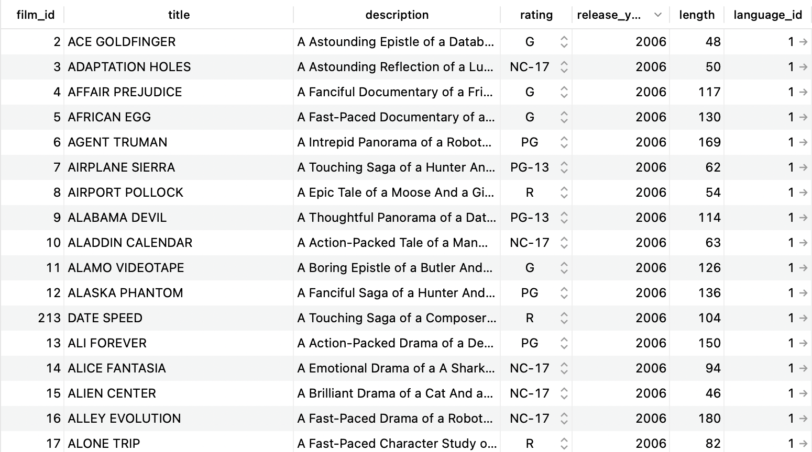
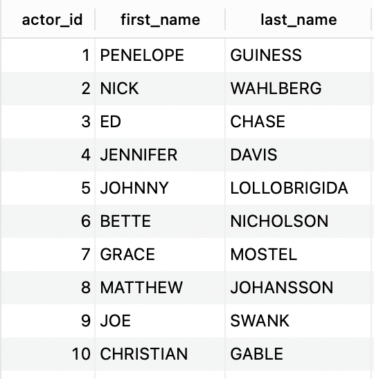
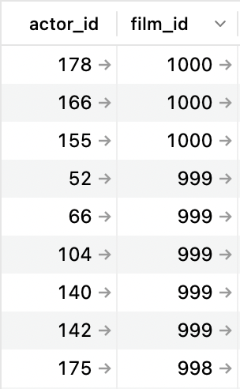
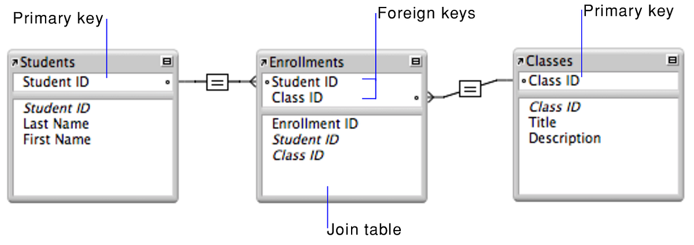

# 8-2-0 SQL and Databases

We've learned how to build a server application using Express. It can serve the static assets for a frontend and can handle requests through an API. But the data is not persistent! 

This week, we'll learn about the tools needed to build a truly "fullstack" web application with a proper database.

Let's dive in!

## Table of Contents

- [Table of Contents](#table-of-contents)
- [Terms](#terms)
- [What is a database?](#what-is-a-database)
  - [What is Postgres?](#what-is-postgres)
  - [What is a relational database?](#what-is-a-relational-database)
  - [Entity Relation Diagrams](#entity-relation-diagrams)
- [What is SQL?](#what-is-sql)
  - [Tips to avoid errors](#tips-to-avoid-errors)
- [Using PostgreSQL and SQL Examples](#using-postgresql-and-sql-examples)
  - [Connecting to PSQL and Creating a DB](#connecting-to-psql-and-creating-a-db)
  - [Managing Tables](#managing-tables)
  - [CRUD Actions within a Table](#crud-actions-within-a-table)
      - [Create - Adding Values to a Table](#create---adding-values-to-a-table)
    - [Read - Getting Values From a Table](#read---getting-values-from-a-table)
    - [Update - Modify Existing Rows](#update---modify-existing-rows)
    - [Delete - Deleting Existing Rows](#delete---deleting-existing-rows)

## Terms

* **Fullstack** - refers to the combination of frontend (client-side) and backend (server-side) technologies.
* **PERN** - an acronym for a specific set of technologies used to build a fullstack web application: Postgres, Express, React, and Node. This acronym is useful when asked "what stack do you use?"
* **Database** - a structured collection of data that is organized in a manner for easy retrieval.
* **Database Management System (DBMS)** - a piece of software used to create and maintain a database.
* **Postgres** - a popular "relational" database management system that stores data in a table-like manner
* **Table** - a collection of related data organized in rows and columns.
  * A **row** represents a single object/instance/record in the table 
  * A **column** represents a property/attribute/field of that object. Columns have data types such as integer, string, date, boolean, etc...
* **SQL (Structured Query Language)** - a language used by relational database management systems to create, read, update, or delete data from a database.


## What is a database?

A **database** is a structured collection of data. The data could be stored in a file or in RAM. In the old days, it was stored on a physical "punch card".


Nowadays, the data is often stored on a dedicated "database server" managed by a piece of software called a **database management system (DBMS)** such as Postgres, MongoDB, SQLite, MySQL, Firebird, Apache Cassandra, and many more.


A server application can send queries to the DBMS using the **Structured Query Language (SQL)** and the DBMS responds with the requested data.

By separating the database from the server application, we achieve greater separation of concerns:
* The database layer is focused solely on managing and securing the data.
* The application layer is focused solely on receiving client requests, retrieving the appropriate data from the database, and sending it back to the client.
* If we need to update or restart the application server, the database server can continue running without losing the data.

### What is Postgres?

PostgreSQL is a popular "relational" DBMS that organizes its data in **tables**. Below is an example of a table with data about various films:



Each table is made up of **rows** and **columns**.
* Each row represents a single object/instance/record in the table 
* Each column represents a property/attribute/field of that object. Columns have data types such as integer, string, date, or boolean.

**Q: In JavaScript, how would this data be organized?**

### What is a relational database?

PostgreSQL is an **object-relational DBMS**, meaning that in addition to storing its data as objects, it allows for relationships between objects across tables.

Here is another table in the same database called `actor`:



Every table has a column that serves as the **primary key**, a unique value assigned to each row in the table. 

> **Q: What is the primary key in the tables above?**
> 
> <details><summary>Answer</summary>
> <br>
>
> `actor_id` is the primary key for the `actor` table. `film_id` is thep primary key for the `film` table.
> 
> </details>

Relationshps can be established between two tables through a **join table**. This table is called `film_actor`:



When the primary keys of another table are used in a join table, they are called **foreign keys**.

> **Q: I want to know what movie `actor_id = 3` is in. How would I find it?**
> 
> <details><summary>Answer</summary>
> 
> 1. Look at the `film_actor` table and find the row where `actor_id = 3`. 
> 2. Take note of the `film_id`. 
> 3. Then, in the `film` table, find the row with the `film_id` you found earlier. 
> 4. Then look at the `title` column!
> 
> </details>

### Entity Relation Diagrams

An **Entity Relation Diagram (ERD)** illistrates the properties of tables (a.k.a. "entities") and their relationships with other tables/entities.



## What is SQL?

SQL (Structured Querying Language) is the language used by many relational DBMSs to create, modify, and retrieve data.

SQL is written in statements that are composed of **keywords** and **clauses**.

```sql
SELECT actor_id, first_name 
FROM actor
WHERE last_name = 'DAVIS';
```

Keywords determine the operation to be performed. Clauses modify the operation.

* Common keywords: `SELECT`, `FROM`, `INSERT INTO`, `UPDATE`, `DELETE`
* Common clauses: `WHERE`, `GROUP BY`, `ORDER BY`

Statements can also include **functions**, **operators**, and **identifiers**.

> **Q: What does the query above look for?**
> 
> <details><summary>Answer</summary>
> 
> The first names of actors who have the last name 'DAVIS'
> 
> </details>

### Tips to avoid errors
* SQL is NOT case sensitive. However, it is a standard practice to write keywords in all-caps to distinguish them from values.
* SQL strings MUST be written with single quotes `''` to avoid unwanted errors.
* SQL queries MUST end in a semicolon `;` to avoid unwanted errors.


---

## Using PostgreSQL and SQL Examples

For practice, [follow along with these instructions](./practice/README.md).

### Connecting to PSQL and Creating a DB

- Go to the command line and connect to your database by running the command `psql`.
  - Now you are connected to PostgreSQL!
  - To exit from PostgreSQL, use `control d`.
- Run the command `\l` within your `psql` command line to see existing databases.

- Create a database called `marcy` by running the command `CREATE DATABASE marcy;`
  - **NOTE** the semi-colon is important for ending the execution of this command! Makes sure to include it.
  - You have successfully created a database if your `psql` command line outputs `CREATE DATABASE`.
- Next, connect to your database by running the command `\c marcy`. 
  - Successfully connecting to your database will output `You are now connected to database "marcy" as user "[your username]"`.

### Managing Tables 

Creating a `lessons` table with the columns `id`, `title`, and `instructor`:

```sql
CREATE TABLE lessons(
  id SERIAL PRIMARY KEY, 
  title TEXT NOT NULL, 
  instructor TEXT NOT NULL
);
```
* `id` will be the primary key. The `SERIAL` data type allows you to automatically generate unique integer numbers (IDs, identity, auto-increment, sequence) for a column. 
* `title` and `instructor` will be of type `TEXT` and are required fields (`NOT NULL`).

Dropping the `lessons` table:

```sql
DROP TABLE lessons;
```

### CRUD Actions within a Table

##### Create - Adding Values to a Table

Inserting a new record/row/object into the `lessons` table with a `title` value of `'Data Structures'` and a `instructor` value of `'Ben'`. The `id` is automatically generated.

```sql
INSERT INTO lessons (title, instructor)
VALUES('Data Structure', 'Ben');
```

#### Read - Getting Values From a Table

Get all data from the `title` and `instructor` columns in the `lessons` table:
```sql
SELECT title, instructor
FROM lessons;
```

Get all data from all columns from the `lessons` table:
```sql
SELECT * 
FROM lessons;
```

Get only all data from all coluns in the `lessons` table, but only from the rows where the value in the `instructor` column is `'Ben'`:

```sql
SELECT *
FROM lessons
WHERE instructor='Ben';
```

Same as above, but now we are also including rows where the value in the `instructor` column is `'Gonzalo'`:

```sql
SELECT *
FROM lessons
WHERE instructor='Ben' OR instructor='Gonzalo';
```

Renaming queries with `AS`:

```sql
SELECT title AS "Course Title"
FROM lessons;
```

Counting the number of rows in the `lessons` table:

```sql
SELECT COUNT(*)
FROM lessons
```

Counting the number of lessons taught by `'Ben'`:

```sql
SELECT COUNT(*)
FROM lessons
WHERE instructor='Ben'
```

Collapsing columns with `GROUP BY`:

```sql
SELECT COUNT(*), instructor 
FROM lessons 
WHERE instructor='ben' 
GROUP BY instructor; 
```

#### Update - Modify Existing Rows

```sql
UPDATE lessons
SET instructor = 'Gonzalo'
WHERE title = 'Data Structures';
```

#### Delete - Deleting Existing Rows

```sql
DELETE FROM lessons
WHERE title = 'Data Structures';
```
